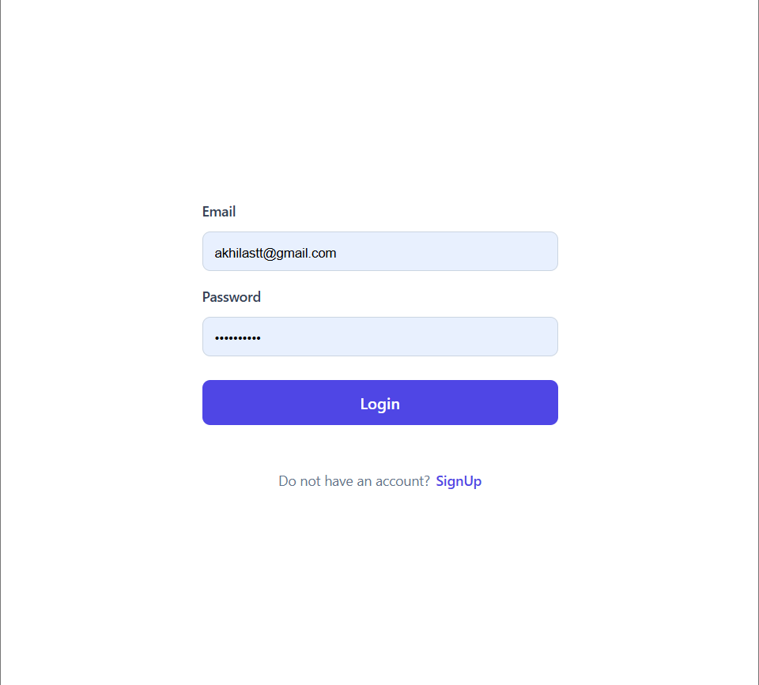
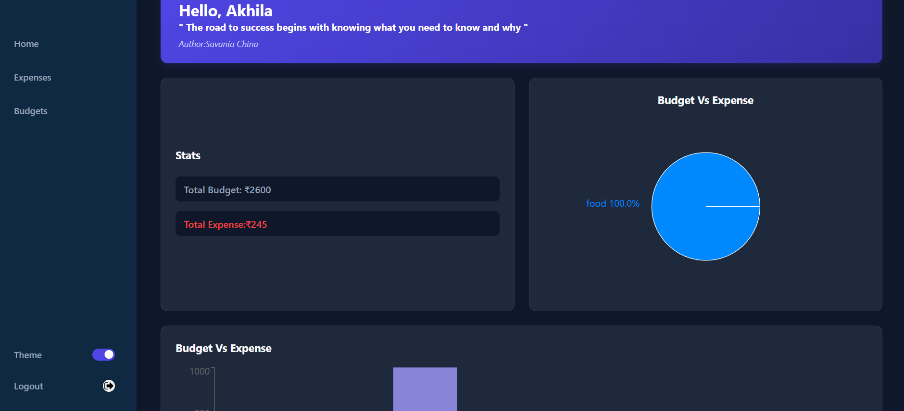
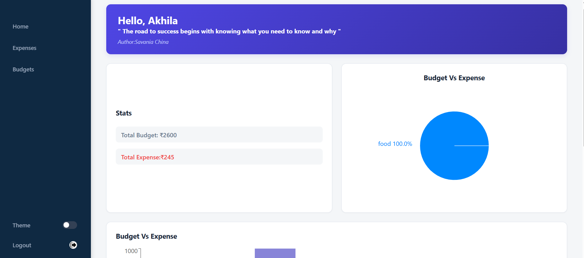
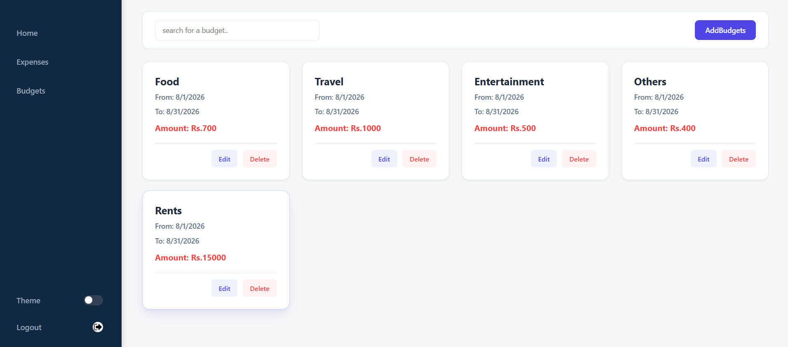
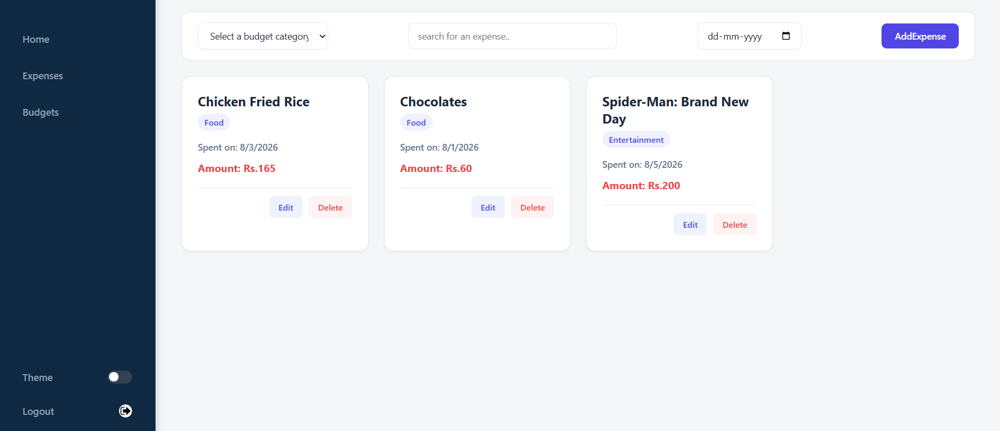

# 💰 Budget Buddy-Personal Expense Tracker

A full-stack Personal Expense Tracker that helps users manage their budgets and expenses efficiently. Users can create budgets, record expenses, monitor spending through an interactive dashboard, and visualize financial data using charts.

---

## ✨ Features

### 🔐 Authentication

* User registration and login
* JWT-based authentication
* Protected routes
* Secure API access

### 💵 Budget Management

* Create new budgets
* Edit existing budgets
* Delete budgets
* Prevent overlapping budgets with the same category
* Budget amount validation
* Budget date range validation

### 📝 Expense Management

* Add expenses under a budget
* Edit expenses
* Delete expenses
* Prevent duplicate expense names on the same day
* Ensure expenses stay within allocated budget
* Validate expense dates against budget timeline

### 📊 Dashboard

* Total Budget vs Total Expense summary
* Budget vs Expense Bar Chart
* Expense Distribution Pie Chart
* Today's Expenses
* Daily motivational quote
* Dark/Light theme toggle

---

## 🛠 Tech Stack

### Frontend

* React
* React Router
* Axios
* Recharts
* CSS

### Backend

* Node.js
* Express.js
* MongoDB
* Mongoose
* JWT Authentication

---

## 📁 Project Structure

```
Personal-Expense-Tracker/
│
├── backend/
│   ├── controllers/
│   ├── middleware/
│   ├── models/
│   ├── routes/
│   ├── app.js
│   └── package.json
│
├── frontend/
│   ├── src/
│   ├── public/
│   ├── package.json
│   └── vite.config.js
│
└── README.md
```

---

## 🚀 Installation

### Clone the repository

```bash
git clone https://github.com/Akhila-Satti/personal_expenses_tracker
```

---

### Backend Setup

```bash
cd backend
npm install
```

Create a `.env` file inside the backend folder.

Example:

```env
MONGO_URI=your_mongodb_connection_string
JWT_SECRET=your_secret_key
API_NINJAS_KEY=your_api_key
```

Run the backend:

```bash
npm start
```

or

```bash
npm run dev
```

---

### Frontend Setup

```bash
cd frontend
npm install
npm run dev
```


## 🔒 Authentication

JWT authentication is used to secure protected routes. Users must log in to access budget management, expense management, and dashboard features.

---

## 📷 Screenshots

  
 
 
 
  
  
---

## 🌟 Future Improvements

* Monthly analytics
* Export expenses as PDF/Excel
* Budget notifications
* Recurring expenses
* Profile management
* Currency selection
* Search and advanced filters

---

## 👨‍💻 Author

**Satti Akhila**

GitHub: https://github.com/Akhila-Satti
